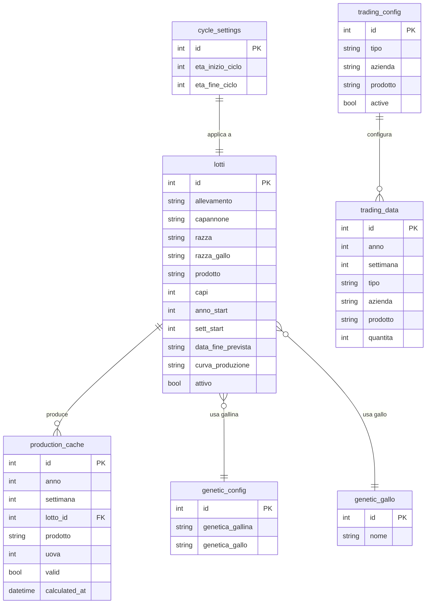

# Database Storage - Incubatoio Manager

Documentazione completa sulla struttura del database e lo storage dei dati.

---

## 📁 Posizione del Database

| Elemento | Valore |
|----------|--------|
| **File** | `incubatoio.db` |
| **Percorso** | `backend/incubatoio.db` |
| **Tipo** | SQLite |
| **Dimensione attuale** | ~245 KB |

> [!IMPORTANT]
> Il percorso del database è risolto in modo assoluto in `database.py` per evitare perdite di dati quando il server viene avviato da directory diverse.

```python
DB_DIR = os.path.dirname(os.path.abspath(__file__))
DATABASE_URL = f"sqlite:///{os.path.join(DB_DIR, 'incubatoio.db')}"
```

---

## 📊 Schema delle Tabelle

Il database contiene **8 tabelle** principali:



---

## 📋 Dettaglio delle Tabelle

### 1. `lotti` (T001 - Accasamenti)

Traccia i lotti di riproduttori e i loro metadati.

| Colonna | Tipo | Descrizione |
|---------|------|-------------|
| `id` | INTEGER | Chiave primaria |
| `allevamento` | VARCHAR | Nome dell'allevamento |
| `capannone` | VARCHAR | Identificativo del capannone |
| `razza` | VARCHAR | Genetica della gallina (FK verso `genetic_config`) |
| `razza_gallo` | VARCHAR | Genetica del gallo (FK verso `genetic_gallo`) |
| `prodotto` | VARCHAR | Tipo di prodotto (es. "Pollo70", "GranPollo") |
| `capi` | INTEGER | Numero di capi nel lotto |
| `anno_start` | INTEGER | Anno di inizio ciclo |
| `sett_start` | INTEGER | Settimana di inizio ciclo |
| `data_fine_prevista` | VARCHAR | Data fine ciclo formato "YYYY/WW" |
| `curva_produzione` | VARCHAR | Nome della curva di produzione utilizzata |
| `attivo` | BOOLEAN | Se il lotto è ancora attivo |

---

### 2. `trading_config` (T004/T005 Config)

Definisce le coppie Azienda+Prodotto che appaiono come colonne nelle tabelle di trading.

| Colonna | Tipo | Descrizione |
|---------|------|-------------|
| `id` | INTEGER | Chiave primaria |
| `tipo` | VARCHAR | "acquisto" o "vendita" |
| `azienda` | VARCHAR | Nome azienda (es. "Boyè", "Amadori") |
| `prodotto` | VARCHAR | Tipo prodotto (es. "Pollo70", "GranPollo") |
| `active` | BOOLEAN | Flag per soft-delete |

**Valori di default seedati:**
- Boyè_Pollo70
- Amadori_GranPollo  
- Fileni_GranPollo
- Estero_Color Yeald

---

### 3. `trading_data` (T004/T005 Dati)

Memorizza le quantità settimanali per acquisti e vendite.

| Colonna | Tipo | Descrizione |
|---------|------|-------------|
| `id` | INTEGER | Chiave primaria |
| `anno` | INTEGER | Anno |
| `settimana` | INTEGER | Settimana (1-53) |
| `tipo` | VARCHAR | "acquisto" o "vendita" |
| `azienda` | VARCHAR | Nome azienda |
| `prodotto` | VARCHAR | Tipo prodotto |
| `quantita` | INTEGER | Quantità di uova |

> [!NOTE]
> La chiave logica è `(anno, settimana, tipo, azienda, prodotto)`.

---

### 4. `production_cache` (Cache Produzione)

Cache dei calcoli di produzione per ottimizzare le performance.

| Colonna | Tipo | Descrizione |
|---------|------|-------------|
| `id` | INTEGER | Chiave primaria |
| `anno` | INTEGER | Anno |
| `settimana` | INTEGER | Settimana |
| `lotto_id` | INTEGER | FK verso `lotti` |
| `prodotto` | VARCHAR | Tipo prodotto |
| `uova` | INTEGER | Uova prodotte calcolate |
| `valid` | BOOLEAN | Se il cache è ancora valido |
| `calculated_at` | DATETIME | Timestamp del calcolo |

> [!TIP]
> La cache viene invalidata automaticamente quando un lotto o una curva di produzione viene modificata.

---

### 5. `genetic_config` (T006 - Genetica Gallina)

Master data per le razze di galline.

| Colonna | Tipo | Descrizione |
|---------|------|-------------|
| `id` | INTEGER | Chiave primaria |
| `genetica_gallina` | VARCHAR | Nome della genetica (es. "JA57 STANDARD") |
| `genetica_gallo` | VARCHAR | Legacy - mantenuto per migrazione |

---

### 6. `genetic_gallo` (T007 - Genetica Gallo)

Master data per le razze di galli.

| Colonna | Tipo | Descrizione |
|---------|------|-------------|
| `id` | INTEGER | Chiave primaria |
| `nome` | VARCHAR | Nome della genetica del gallo (es. "ROSS M") |

---

### 7. `cycle_settings` (Impostazioni Ciclo)

Parametri globali per il calcolo del ciclo produttivo.

| Colonna | Tipo | Default | Descrizione |
|---------|------|---------|-------------|
| `id` | INTEGER | 1 | Sempre 1 (singleton) |
| `eta_inizio_ciclo` | INTEGER | 24 | Settimana di età inizio ciclo |
| `eta_fine_ciclo` | INTEGER | 64 | Settimana di età fine ciclo |

> [!IMPORTANT]
> Questi valori controllano le colonne calcolate "Inizio Ciclo" e "Fine Ciclo" in T001.

---

### 8. `cycle_weekly_data` (Dati Avanzati Ciclo)

Dati settimanali per ogni ciclo produttivo (mortalità, uova, mangime, luci).

| Colonna | Tipo | Descrizione |
|---------|------|-------------|
| `id` | INTEGER | Chiave primaria |
| `lotto_id` | INTEGER | FK verso `lotti` |
| `eta_animali` | INTEGER | Età in settimane (parte da 19) |
| `anno` | INTEGER | Anno settimana solare (calcolato) |
| `settimana` | INTEGER | Settimana solare (calcolata) |
| `galline_morte` | INTEGER | Mortalità galline settimanale |
| `galli_morti` | INTEGER | Mortalità galli settimanale |
| `uova_incubabili` | INTEGER | Uova incubabili raccolte |
| `uova_seconda` | INTEGER | Uova di seconda scelta |
| `tipo_mangime` | VARCHAR | Tipo/nome mangime |
| `accensione_luce` | VARCHAR | Orario accensione (es. "05:00") |
| `spegnimento_luce` | VARCHAR | Orario spegnimento (es. "21:00") |

> [!NOTE]
> La W Solare viene calcolata automaticamente: `W Solare = Sett_Start + Età Animali`

---

### 9. `birth_rates` (T008 - Tabelle di Nascita)

Percentuali di nascita per prodotto e settimana di età.

| Colonna | Tipo | Descrizione |
|---------|------|-------------|
| `id` | INTEGER | Chiave primaria |
| `week` | INTEGER | Settimana di età (24-64) |
| `product` | VARCHAR | Prodotto (granpollo, pollo70, colorYeald, ross) |
| `rate` | FLOAT | Percentuale nascita (es. 82.00) |

> [!NOTE]
> La chiave logica è `(week, product)`. Editabile via UI con doppio-click.

---

### 10. `purchase_birth_rates` (T009 - Nascita Uova in Acquisto)

Percentuali di nascita per uova acquistate (una sola riga per prodotto).

| Colonna | Tipo | Descrizione |
|---------|------|-------------|
| `id` | INTEGER | Chiave primaria |
| `product` | VARCHAR | Prodotto (granpollo, pollo70, colorYeald, ross) - UNIQUE |
| `rate` | FLOAT | Percentuale nascita (default: 84.00) |

> [!NOTE]
> Una sola riga per prodotto. Editabile via UI con doppio-click.

---

### 11. `chick_planning` (T010 - Pianificazione Nascite)

Valori editabili per la pianificazione nascite per prodotto.

| Colonna | Tipo | Descrizione |
|---------|------|-------------|
| `id` | INTEGER | PK |
| `anno` | INTEGER | Anno settimana nascita |
| `settimana` | INTEGER | Settimana nascita |
| `product` | VARCHAR | Prodotto |
| `richiesta_guidi` | INTEGER | Default 80000 |
| `altri_clienti` | INTEGER | Default 3000 |

> [!NOTE]
> Chiave logica: `(anno, settimana, product)`. Editabile via UI con doppio-click.

---


## 📂 File di Dati Esterni

### ~~`dati.csv`~~ - Deprecato (Spostato in OLD/)

> [!CAUTION]
> **File deprecato!** Il sistema ora usa SOLO la tabella `standard_curves` nel database.
> Il file `dati.csv` è stato spostato in `OLD/dati.csv` per riferimento storico.

Il seeding iniziale delle curve di produzione deve essere fatto direttamente nel database tramite:
- Import SQL manuale
- Script di migrazione
- UI di amministrazione (se implementata)

**Curve disponibili in `standard_curves`:**
- JA57 STANDARD
- JA57K STANDARD  
- JA57KI STANDARD
- JA87 STANDARD
- RANGER STANDARD
- GOLDEN STANDARD
- ROSS 308 STANDARD
- JA57K x S77N STORICO
- JA57KI x CY STORICO
- JA87 (senza suffisso)
- RANGER x CNB STORICO
- GOLDEN STORICO

**Range di età:** Settimane 25-65

---

## 🔄 Pattern di Persistenza

### Soft Delete

Le configurazioni (Trading, Genetics) usano **soft delete** invece di eliminazione fisica:
- `trading_config.active = False` invece di DELETE
- Preserva le associazioni storiche dei dati

### Migrazioni Silenziose

All'avvio, `init_db()` tenta di aggiungere colonne mancanti:

```python
# Esempio di migrazione silente
try:
    conn.execute(text("ALTER TABLE lotti ADD COLUMN curva_produzione VARCHAR"))
    conn.commit()
except Exception:
    pass  # Colonna già esistente
```

### Header Parsing (Trading)

I dati di trading sono recuperati in formato "wide" per la UI:
- Join tra `trading_data` e `trading_config`
- Pivot basato sulla convenzione `[Azienda]_[Prodotto]`

---

## 📍 Riferimenti nel Codice

| File | Contenuto |
|------|-----------|
| [database.py](file:///c:/Users/ogino/OneDrive/Documenti/GitHub/incubatoio-manager/backend/database.py) | Modelli SQLAlchemy, funzioni CRUD, setup connessione |
| [dati.csv](file:///c:/Users/ogino/OneDrive/Documenti/GitHub/incubatoio-manager/backend/dati.csv) | Curve di produzione standard |
| [production_service.py](file:///c:/Users/ogino/OneDrive/Documenti/GitHub/incubatoio-manager/backend/services/production_service.py) | Logica di calcolo produzione e cache |

---

*Ultimo aggiornamento: Gennaio 2026*
